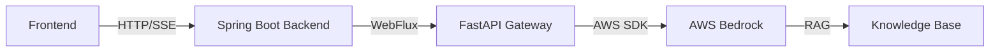

# History AI Backend

AWS Bedrock과 Knowledge Base를 활용한 Spring Boot 기반 AI 챗봇 백엔드 서비스입니다.

## 🚀 주요 기능

- **스트리밍 AI 채팅**: Server-Sent Events(SSE)를 통한 실시간 스트리밍 응답
- **AWS Bedrock Knowledge Base**: RAG(Retrieval-Augmented Generation) 기반 지식 검색
- **FastAPI 게이트웨이**: FastAPI 서버를 통한 AWS Bedrock 연동
- **멀티바이트 문자 지원**: 한글 등 멀티바이트 문자의 안전한 스트리밍 처리

## 📋 기술 스택

- **Framework**: Spring Boot 3.4.12
- **Language**: Java 17
- **Database**: PostgreSQL
- **AWS SDK**: Bedrock Runtime 2.39.5, Bedrock Agent Runtime 2.39.5
- **Reactive**: Spring WebFlux (Reactor)
- **Build Tool**: Gradle

## 🏗️ 프로젝트 구조

```
src/main/java/com/lgcns/haibackend/
├── HaibackendApplication.java           # Spring Boot 메인 애플리케이션
└── bedrock/
    ├── client/                          # FastAPI 클라이언트 (DTO, API 호출)
    │   ├── ChatRequest.java
    │   ├── ChatResponse.java
    │   ├── FastApiClient.java
    │   ├── KnowledgeBaseRequest.java
    │   ├── Message.java
    │   ├── Model.java
    │   ├── ModelsResponse.java
    │   └── SimpleChatRequest.java
    ├── config/                          # 설정 클래스
    │   └── FastApiClientConfig.java
    ├── controller/                      # REST API 컨트롤러
    │   └── BedrockController.java
    └── service/                         # 비즈니스 로직
        └── BedrockService.java
```

## 🔧 환경 설정

### 필수 환경 변수

`.env` 파일을 생성하고 다음 환경 변수를 설정하세요:

```bash
# Database Configuration
SPRING_DATASOURCE_URL=jdbc:postgresql://localhost:5432/your_database
SPRING_DATASOURCE_USERNAME=your_username
SPRING_DATASOURCE_PASSWORD=your_password

# AWS Bedrock Configuration
AWS_BEDROCK_CHAT_MODEL=anthropic.claude-3-haiku-20240307-v1:0
AWS_BEDROCK_KB_ID=your_knowledge_base_id
AWS_BEDROCK_KB_MODEL_ARN=arn:aws:bedrock:your-region::foundation-model/your-model

# AWS Credentials (선택사항 - AWS CLI 설정으로 대체 가능)
AWS_ACCESS_KEY_ID=your_access_key
AWS_SECRET_ACCESS_KEY=your_secret_key
AWS_REGION=ap-northeast-2
```

### application.yaml

프로젝트에는 `application.yaml` 파일이 포함되어 있으며, 위 환경 변수를 참조합니다.

## 🏃 실행 방법

### 1. 프로젝트 빌드

```bash
./gradlew build -x test
```

### 2. 애플리케이션 실행

```bash
./gradlew bootRun
```

또는

```bash
java -jar build/libs/haibackend-0.0.1-SNAPSHOT.jar
```

### 3. 서버 확인

기본 포트: `http://localhost:8081'

## 📡 API 엔드포인트

### 1. AI 채팅 (스트리밍)

Knowledge Base를 활용한 스트리밍 AI 채팅

```http
POST /api/ai/chat
Content-Type: application/json

{
  "message": "질문을 입력하세요"
}
```

**응답**: `text/event-stream` (Server-Sent Events)

```json
data: {"type": "content", "text": "응답 내용..."}
data: {"type": "content", "text": "계속..."}
```

### 2. 사용 가능한 모델 목록

```http
GET /api/ai/models
```

**응답**:

```json
[
  {
    "id": "anthropic.claude-3-haiku-20240307-v1:0",
    "name": "Claude 3 Haiku"
  }
]
```

### 3. 헬스 체크

```http
GET /api/ai/health
```

**응답**:

```json
{
  "status": "healthy",
  "fastapi_gateway": "connected"
}
```

## 🧪 테스트

### 단위 테스트 실행

```bash
./gradlew test
```

### FastAPI 연동 테스트

```bash
./gradlew test --tests "com.lgcns.haibackend.bedrock.client.*"
```

## 🔗 연동 구조



## 📝 주요 의존성

```gradle
dependencies {
    // Spring Boot
    implementation 'org.springframework.boot:spring-boot-starter-web'
    implementation 'org.springframework.boot:spring-boot-starter-webflux'
    implementation 'org.springframework.boot:spring-boot-starter-data-jpa'
    
    // Database
    runtimeOnly 'org.postgresql:postgresql'
    
    // AWS Bedrock
    implementation 'software.amazon.awssdk:bedrockruntime:2.39.5'
    implementation 'software.amazon.awssdk:bedrockagentruntime:2.39.5'
    
    // Utilities
    implementation 'io.github.cdimascio:dotenv-java:3.0.0'
    compileOnly 'org.projectlombok:lombok'
    annotationProcessor 'org.projectlombok:lombok'
}
```

## 🛠️ 개발 환경

- **Java**: 17 이상
- **Gradle**: 8.x
- **IDE**: IntelliJ IDEA 권장
- **Database**: PostgreSQL 13 이상


## 👥 기여

LG CNS AM INSPIRE 교육팀

---

**Note**: AWS 자격 증명과 Bedrock Knowledge Base 설정이 올바르게 구성되어 있어야 정상 작동합니다.
